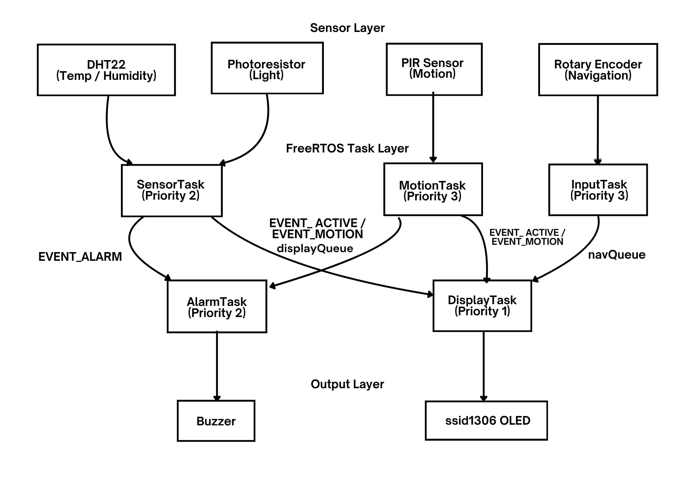
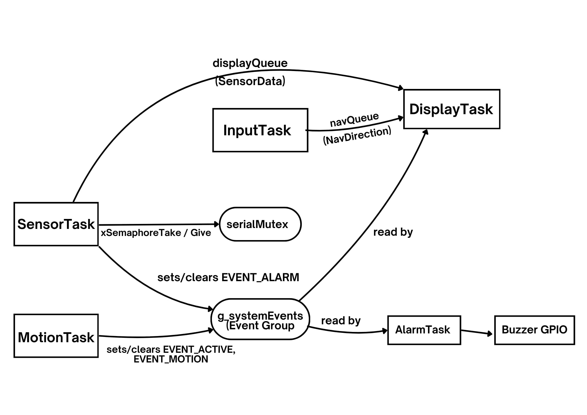
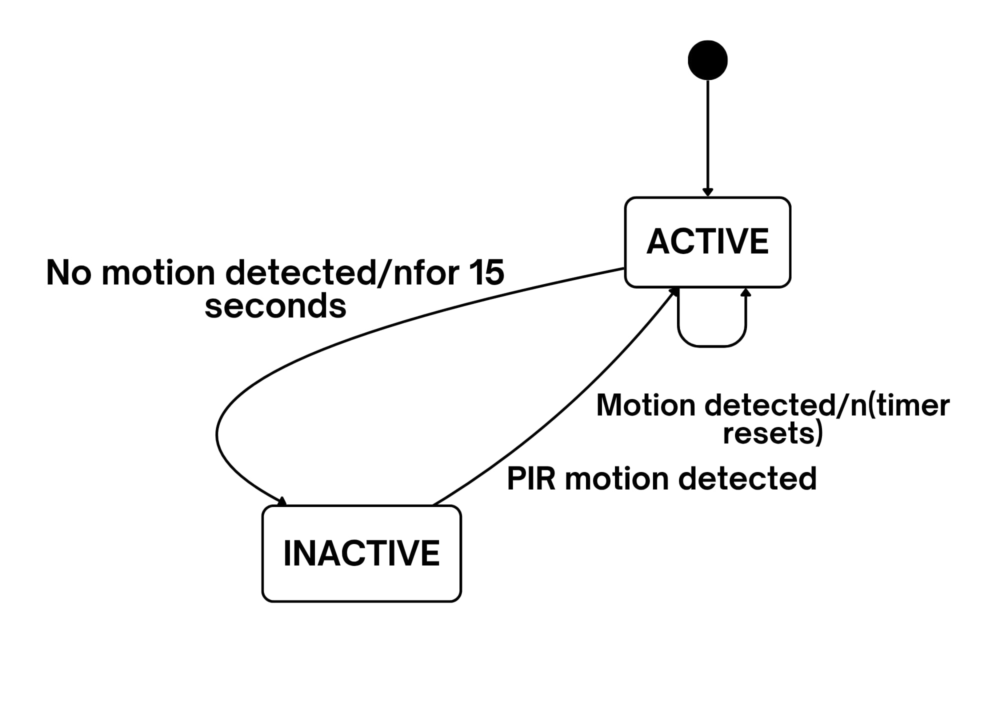
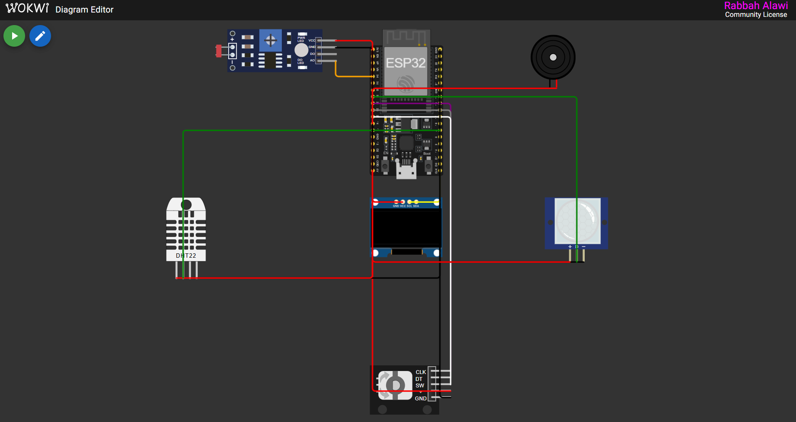
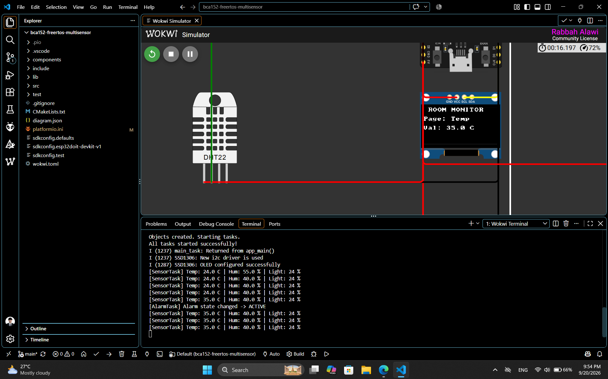

# BCA152 FreeRTOS Multisensor — Real-Time Room Monitoring System

A real-time, multitasking room-monitoring system built on the ESP32 using **FreeRTOS** (via ESP-IDF, no Arduino framework) and simulated in **Wokwi**. The system continuously monitors temperature, humidity, ambient light, and motion, displays live readings on an OLED screen navigable via a rotary encoder, and raises a buzzer alarm when temperature leaves a safe range.

Developed for **BCA152 Microcontrollers**, Mindanao State University – Iligan Institute of Technology.

---

## Features

- **Temperature & humidity monitoring** via a simulated DHT22 sensor
- **Ambient light sensing** via a photoresistor (LDR)
- **Motion detection** via a PIR sensor, driving an automatic ACTIVE/INACTIVE system state
- **OLED display** (SSD1306) cycling through Temperature, Humidity, Light, and Motion pages
- **Rotary encoder navigation** to manually switch display pages
- **Temperature alarm** — buzzer activates automatically outside the 18 °C–30 °C safe range
- Built on **5 concurrent FreeRTOS tasks**, each with explicit priorities, communicating via a queue, an event group, and a mutex
- **13 unit tests** (Unity framework) covering alarm logic, display navigation, and system-state transitions — all passing
- Static code analysis performed and documented

---

## Hardware / Simulated Components

| Component | Purpose | ESP32 Pin(s) |
|---|---|---|
| DHT22 | Temperature & humidity | GPIO 4 |
| Photoresistor (LDR) | Ambient light level | GPIO 34 (ADC) |
| PIR motion sensor | Motion detection | GPIO 33 |
| Rotary encoder (KY-040) | Display page navigation | CLK: GPIO 25, DT: GPIO 26, SW: GPIO 27 |
| SSD1306 OLED (I2C) | Status display | SDA: GPIO 21, SCL: GPIO 22 |
| Buzzer | Temperature alarm | GPIO 14 |

---

## System Architecture



---

## FreeRTOS Task Communication



**Synchronization primitives:**
- **`displayQueue`** — carries the latest `SensorData` struct from `SensorTask` to `DisplayTask`.
- **`navQueue`** — carries `NavDirection` (NEXT/PREVIOUS) from `InputTask` to `DisplayTask`.
- **`g_systemEvents`** (event group) — bits `EVENT_ACTIVE`, `EVENT_MOTION`, `EVENT_ALARM`, written by `SensorTask`/`MotionTask`, read by `DisplayTask`/`AlarmTask`.
- **`serialMutex`** — protects shared UART/`printf` output from interleaving between tasks.

---

## System State Machine



The system starts **ACTIVE**. `MotionTask` polls the PIR sensor every 100 ms; if no motion is detected for a continuous 15-second window, the system transitions to **INACTIVE** (OLED blanks). Any motion detected while INACTIVE immediately returns the system to **ACTIVE**.

---

## Wokwi Circuit Diagram



---

## Finished System (Running Simulation)



---

## FreeRTOS Task Summary

| Task | Priority | Period / Trigger | Responsibility |
|---|---|---|---|
| `MotionTask` | 3 (highest) | 100 ms polling | Monitor PIR, manage ACTIVE/INACTIVE state |
| `InputTask` | 3 (highest) | 10 ms polling | Read rotary encoder, send navigation events |
| `SensorTask` | 2 (medium) | 2 s (`vTaskDelayUntil`) | Read DHT22 + LDR, evaluate alarm condition |
| `AlarmTask` | 2 (medium) | Event-driven | Drive buzzer based on `EVENT_ALARM` |
| `DisplayTask` | 1 (lowest) | ~100 ms loop | Own the OLED, render the current display page |

---

## Project Structure
```
bca152-freertos-multisensor/
├── include/ # Header files 
├── src/ # Source files 
│ ├── main.cpp
│ ├── alarm.cpp
│ ├── display.cpp
│ ├── input.cpp
│ ├── motion.cpp
│ ├── rtos_objects.cpp
│ ├── sensors.cpp
│ └── system_state.cpp
├── test/
│ └── test_main.cpp 
├── docs/
│ ├── laboratory-report.pdf
│ └── images
│ ├── architecture-diagram.jpg
│ ├── task-communication-diagram.jpg
│ ├── state-machine-diagram.jpg
│ ├── wokwi-circuit.png
│ └── finished-system.png
├── diagram.json #
├── wokwi.toml
└── platformio.ini
```
---

## Building and Running

### Prerequisites
- [PlatformIO](https://platformio.org/) (VS Code extension or CLI)
- [Wokwi Simulator](https://wokwi.com/) (VS Code extension, for simulation)

### Build the firmware
```bash
pio run -e esp32doit-devkit-v1
```

### Run the unit tests
```bash
pio test -e test --without-uploading --without-testing
```
Then point `wokwi.toml` at `.pio/build/test/firmware.bin` / `.elf` and run the Wokwi simulation to see the Unity PASS/FAIL results in the serial terminal.

### Run the simulation
Open the project in VS Code with the Wokwi extension installed, ensure `wokwi.toml` points at `.pio/build/esp32doit-devkit-v1/firmware.bin`, and start the simulation.

---

## Testing Summary

- **Unit tests:** 13/13 passing (temperature alarm boundaries, display navigation, system-state transitions)
- **Static analysis:** `pio check` performed and interpreted — see `docs/laboratory-report.pdf`, Section 6
- **Functional verification:** FT-01 through FT-10 executed in Wokwi — see `docs/laboratory-report.pdf`, Section 5.3
- **Fault experiments:** three deliberate FreeRTOS fault injections (removed blocking, changed priority, removed mutex) — see `docs/laboratory-report.pdf`, Section 5.4

---

## Full Laboratory Report

See [`docs/laboratory-report.pdf`](docs/laboratory-report.pdf) for the complete write-up, including requirements traceability, design rationale, verification records, and engineering discussion.

---

## Author

Rabbah Alawi — BCA152 Student — Mindanao State University – Iligan Institute of Technology
